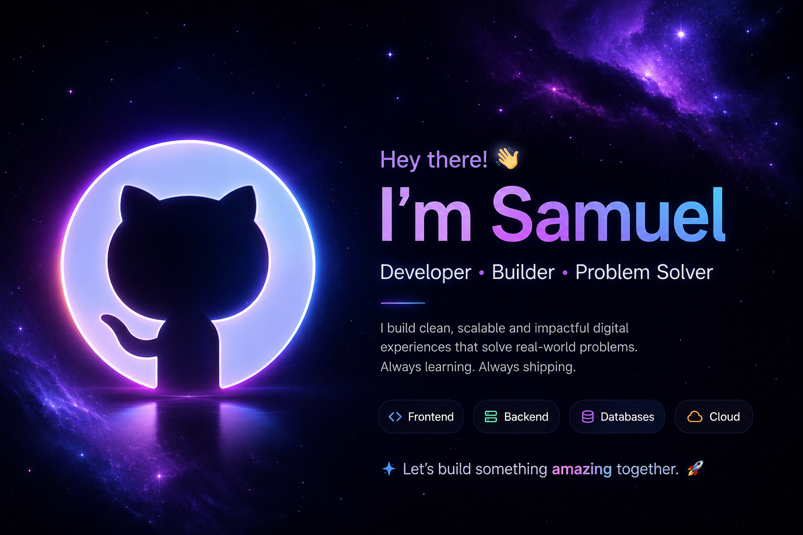

  

<!-- ====== Profile Header ====== -->

  <h1>👋 Hi, I’m Samuel Adikah (@sam-Adk)</h1>
  

<!-- ====== About Me ====== -->
## 👀 I’m interested in
- Health and Medicine  
- Human Resources Management  
- Finance  
- Sports
- AWS cloud computing
- backend web dev
- investment Risk Management

## 🌱 I’m currently learning
- Python  
- R  
- SQL  
- Spreadsheet & Excel  
- Data Science & Data Analytics  
- AWS Cloud Computing  
- Human Resources Management / Admin
- backend web development

## 💞️ I’m looking to collaborate on
- Tech Companies  
- Human Resources Projects  
- Corporate Sales Analysis  
- Sports Analytics  

<!-- ====== Featured Projects ====== -->
## 🔗 Featured Projects

  

## 📫 How to reach me
- ✉️ Email: <samsmollett50@gmail.com>  
- 🔗 LinkedIn: [linkedin.com/in/samuel-adikah](https://linkedin.com/in/samuel-adikah)  

